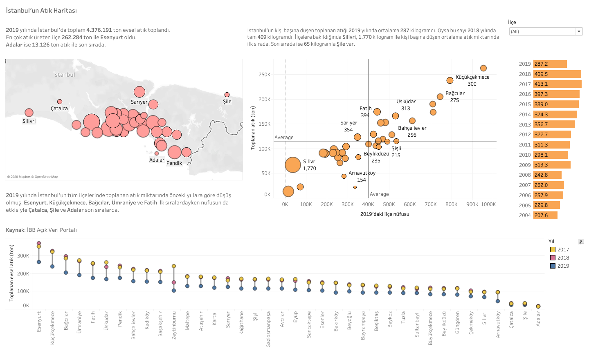

# İstanbul'un atık haritası

İBB'nin açık veri portalında yayınladığı ilçe ve atık türlerine göre hazırlanan veri setini kullanarak İstanbul'un ilçelerine göre evsel atıklarını anlatan bir görselleştirme yaptım.

:egg: Veri kaynağı olarak [İBB Açık Veri Portalı](https://data.ibb.gov.tr/tr/dataset/ilce-yil-ve-atik-turu-bazinda-atik-miktari/resource/50036dfd-aea5-4f06-832f-f7020fdaaa5a)'nı kullandım.

:fried_egg: Görselleştirme aracı olarak Tableau kullandım.

:coffee: Veri görselleştirmesini interaktif olarak [buradan](https://public.tableau.com/profile/bekirarslan#!/vizhome/stanbulunAtkHaritas/Dashboard?publish=yes) inceleyebilirsiniz.

*2019 yılında İstanbul'da toplam 4.376.191 ton evsel atık toplanmış. En çok atık üreten ilçe 262.284 ton ile Esenyurt oldu.  Adalar ise 13.126 ton atık ile son sırada. İstanbul'un kişi başına düşen toplanan atığı 2019 yılında ortalama 287 kilogramdı. Oysa bu sayı 2018 yılında tam 409 kilogramdı. İlçelere bakıldığında Silivri, 1.770 kilogram ile kişi başına düşen ortalama atık miktarında ilk sırada. Son sırada ise 65 kilogramla Şile var.*

---

